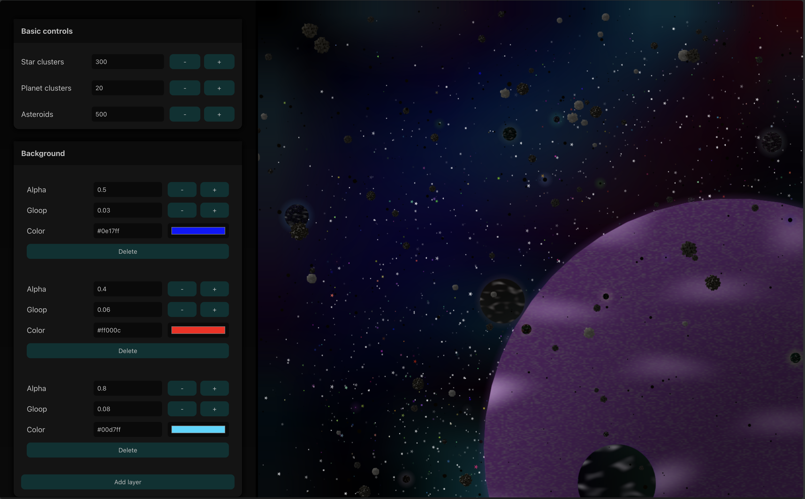

# Twinkling Stars

_View this in action at https://starscape.leems.dev_

Animated stars, planets and nebula simulation built on HTML canvas using an ECS based approach.

## How to use

*Basic controls*

- Star clusters controls the number of groups of stars. For example, if you set this to 10, you will get 10 groups of stars, each with 10 - 40 individual stars.
- Planet clusters controls the number of groups of planets.
- Asteroids is the number of asteroids (1:1 mapping)

*Background*

This section adds nebula style background effects. These are generated using `simplex-noise` so incur a performance cost, but the images generated are very small, so it's unnoticeable unless you have hundreds of layers.

Each layer has three properties:

- Alpha controls the transparency of the layer
- Gloop controls the smoothness of the noise generated. Higher factors result in frequent, small patches of color; lower numbers make it more... gloopy :) 
- Color controls the color of the layer

## Example

Here is an example of a generation using some config. 

